## What Does It Mean To Give 100%?

  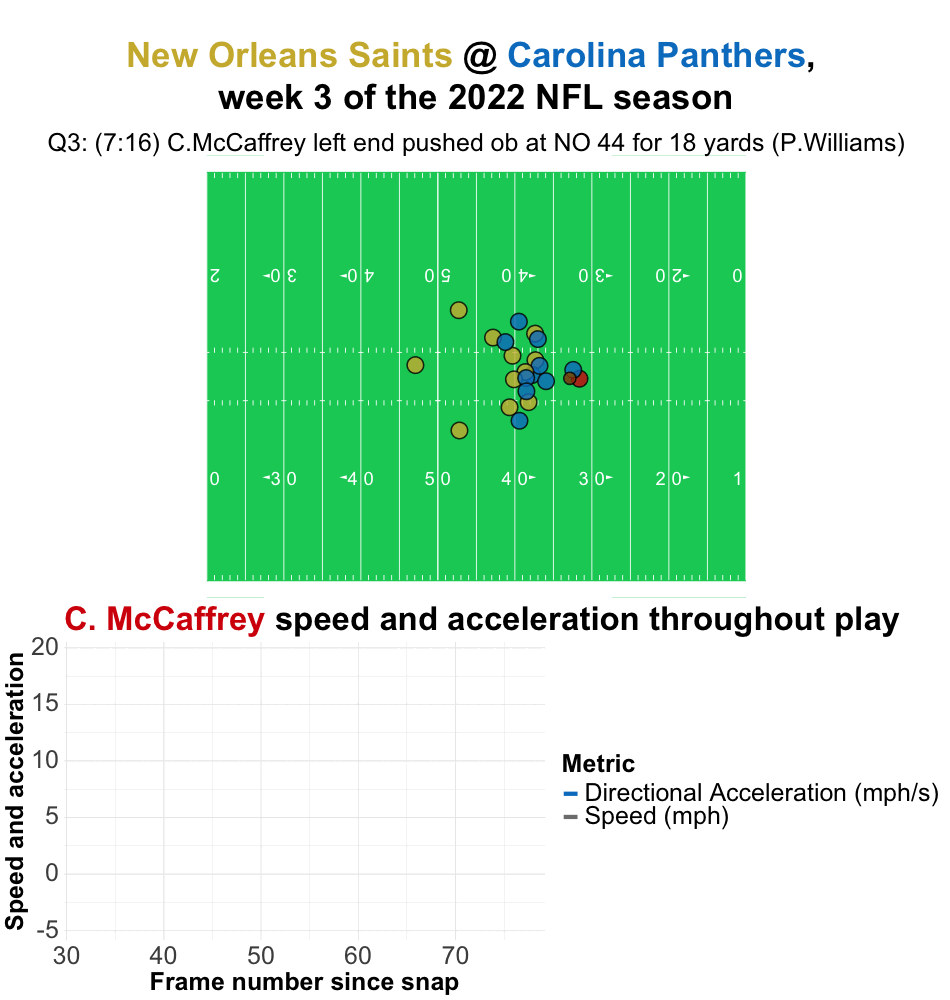

## Background

* Effort is intangible and subjective

* Currently no objective measure of effort exists in the NFL

* Idea: previous research has explored professional soccer players reaching theoretical max acceleration capacity[^1]

* Goals:

  * Improve estimation of individual acceleration-speed (A-S) profiles using statistical models
  
  * Assess how frequently players operate near or exceed their physical limits as a **proxy for effort**

[^1]: Morin, et al. 2021. “Individual Acceleration-Speed Profile in-Situ: A Proof of Concept in Professional Football Players.” Journal of Biomechanics 123: 110524.

  
## Data: 2022 NFL Season[^2]
 
* Game, play, player data from Weeks 1-9: 136 games

* Player tracking data: each observation is a frame in 10 fps

* Pre-processing:

  * Filtered to running plays where a running back (RB) is the ball carrier

  * Trimmed each play to frames between handoff and end of play
  
  * Derived directional acceleration
  
::: {.fragment style="margin-top: -1.4em;"}
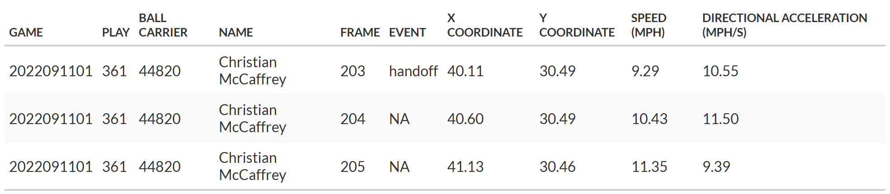
:::
  
[^2]: Courtesy of NFL Big Data Bowl 2025

## Motivation: Estimate Each RB's Theoretical Max Acceleration Frontier (Morin et al., 2021)

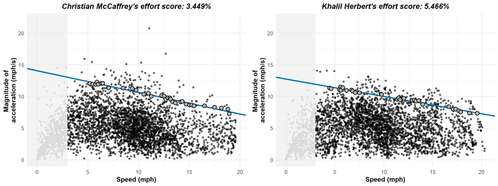{width="100%" height="400"}

* Effort = % of a player's points (frames) close to and above the regression line

## But This Approach Has Limitations

* Gives no credit to low speed points

* Unrealistic theoretical max speeds - not comparable to soccer

* Penalizes players for being athletic 

* Does not differentiate between acceleration and deceleration

* Sensitive to short-term fluctuations

  * Smooth out noise by taking 5-frame rolling mean of speed and directional acceleration 
  
## Effort Metric #1: Quadratic Quantile Regression

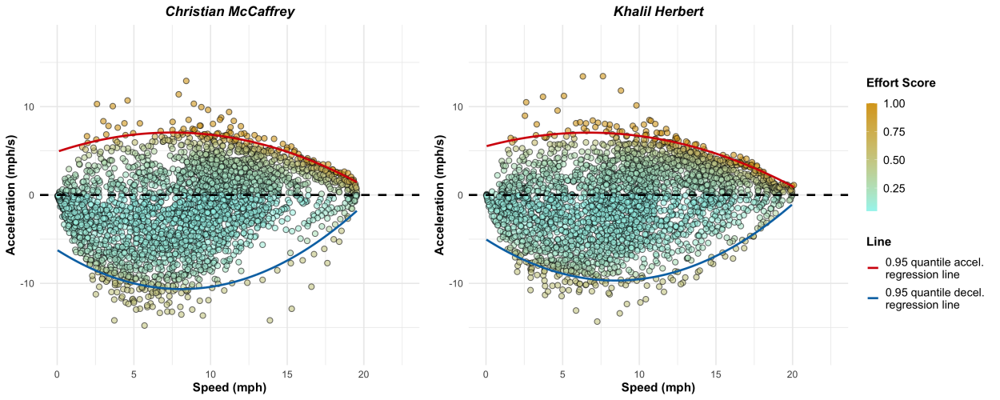{width="100%" height="400"}

* **Effort Metric #1:**

  * Christian McCaffrey: 19.84%

  * Khalil Herbert: 21.99%

## Effort Metric #2: Quantile Generalized Additive Model (QGAM)

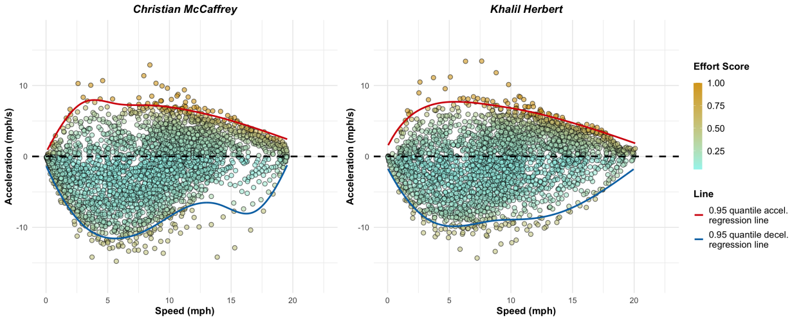{width="100%" height="400"}

* **Effort Metric #2:**

  * Christian McCaffrey: 19.68%
  
  * Khalil Herbert: 20.94%

## Computing Effort

::: {.callout-note title="Average frame-level effort for each player" style="font-size: 1.5em;"}
$$
\Psi_i = \begin{cases}
  \frac{1}{1+d_i} & a_i\geq 0 \\
  \frac{1}{2}\cdot\frac{1}{1+d_i} & a_i<0
  \end{cases} \quad \implies \quad \text{Effort} = \frac{\sum_{i=1}^n \Psi}{n}
$$
:::

* $d_i$ = vertical distance from point to its respective 95th quantile line (postive vs. negative acceleration)

  * Points surpassing the respective 95th quantile line are assigned a distance of 0

* $a_i$ = directional acceleration

  * Penalize points with negative acceleration by $1/2$ because deceleration is not as effortful[^3]
  
* Compute average frame-level scores to obtain the percentage of effortful frames 
  
[^3]: Hader, K., Mendez-Villanueva, A., Palazzi, D., Ahmaidi, S., & Buchheit, M. (2016). Metabolic Power Requirement of Change of Direction Speed in Young Soccer Players: Not All Is What It Seems. PloS one, 11(3), e0149839. https://doi.org/10.1371/journal.pone.0149839

## Back-up RBs Lead Rankings

::: columns
::: column
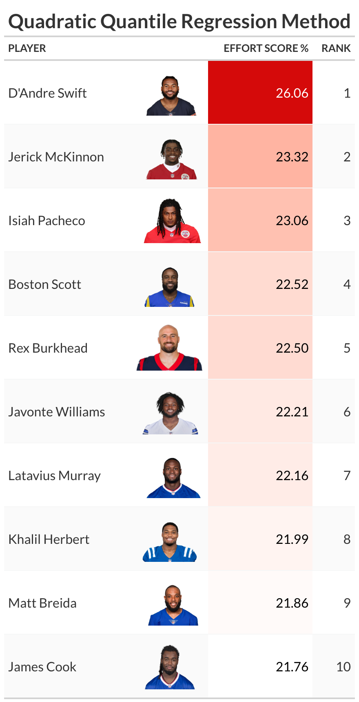
:::

::: column
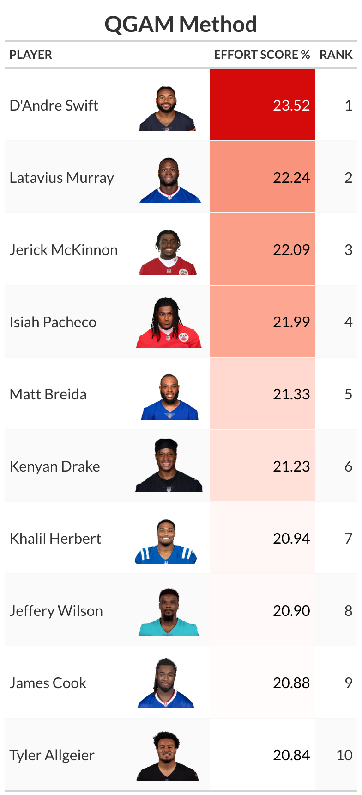
:::
:::

## Mix of RBs Towards Bottom

::: columns
::: column
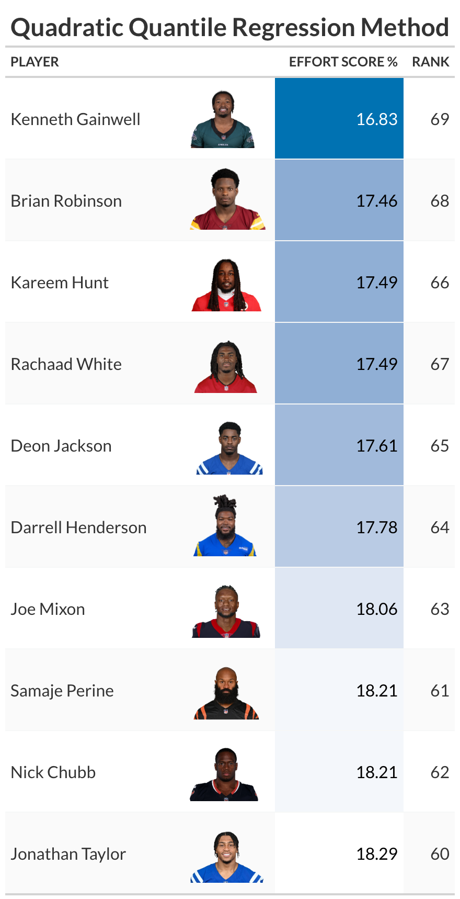
:::

::: column
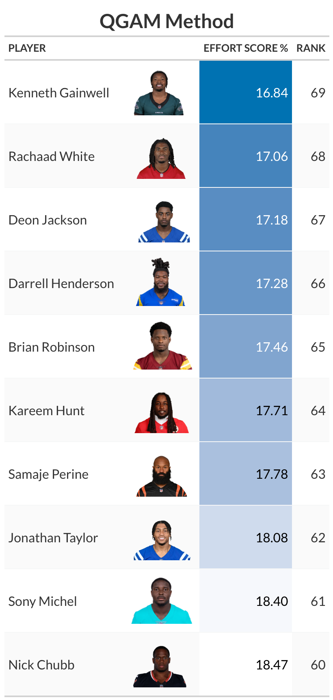
:::
:::

## Effort Metrics Do Not Show a Strong Correlation with Play Outcomes

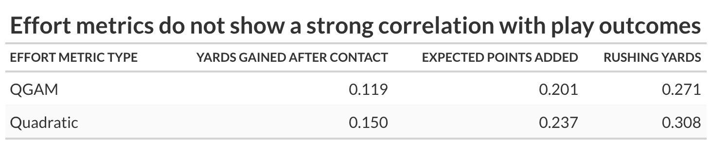{width="90%"}
  
* <u>**Conclusion**</u>: By our definition, effort may not result in favorable play outcomes

  * Individual effort may only benefit a team to an extent
  
  * Football is context dependent and a team sport

  
## Shifting Gears: WRs

* RBs typically give their full effort on every single play running the ball

  * In what scenarios might offensive players not exhibit maximal effort?
  
* Leads us to wide receivers: do they give same effort when they are targeted vs. when they are not?

## WRs: Data

* Pre-processing:

  * Filter to frames of receivers running their routes

  * Filter to from when ball is snapped to when pass arrives to intended receiver 

  * Same speed and directional acceleration calculations with 5-frame rolling mean as for RBs

::: {.fragment style="margin-top: -1.4em;"}

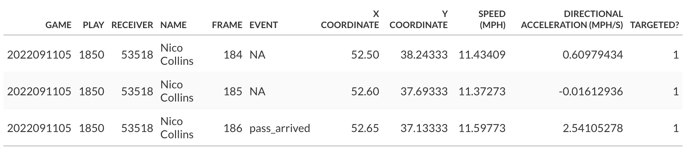

:::

## WRs Effort Metric: QGAM Approach

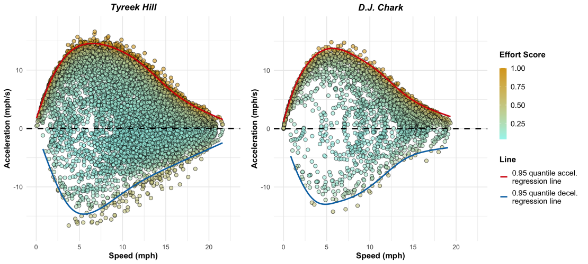{width="100%" height="400"}

::: columns
::: column

* <u>**Hill:**</u>

  * Overall Effort Score: 25.10%
  
  * Targeted Score: 26.13%
  
  * Not Targeted Score: 24.43%
  
:::

::: column

* <u>**Chark:**</u>

  * Overall Effort Score: 31.83%
  
  * Targeted Score: 35.55%
  
  * Not Targeted Score: 30.96%

:::
:::

## Chark and Gallup Show High Effort 

::: columns
::: column
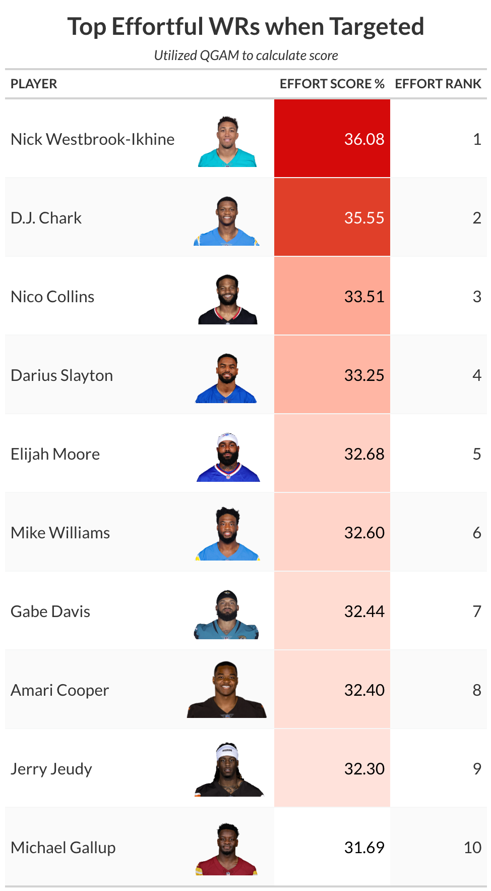
:::

::: column
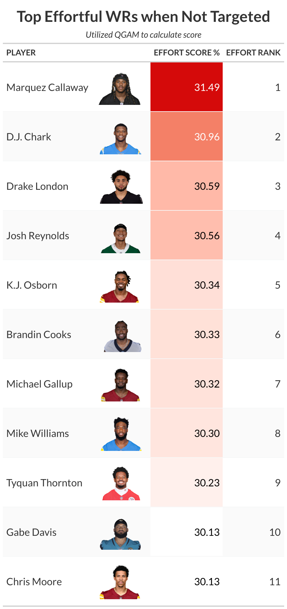
:::
:::

## Bateman Shows Low Effort

::: columns
::: column
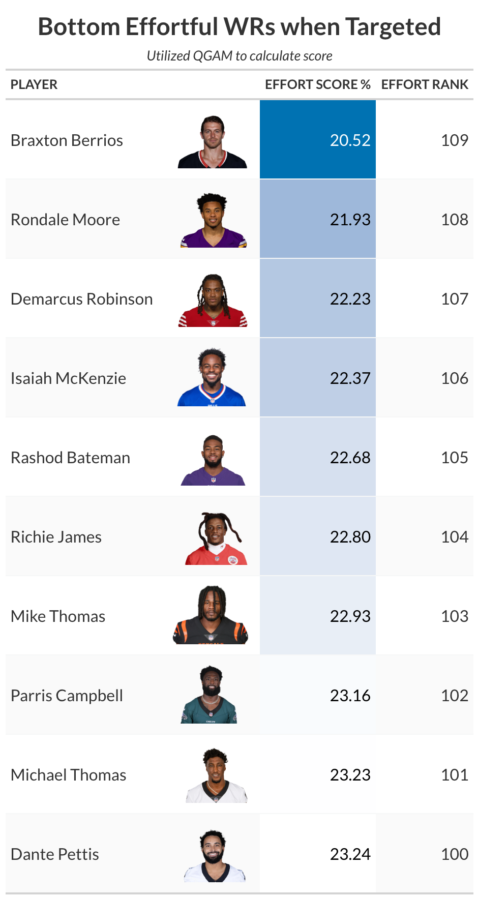
:::

::: column
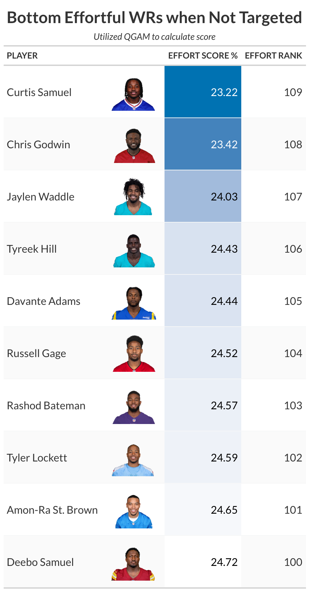
:::
:::

## Discussion

* Conclusions

  * A-S-based effort alone does not explain performance
  
  * Metric quantifies how often a player comes to his acceleration frontier
  
  * Suprising that some WRs gave more effort when not targeted vs. targeted
  
* Limitations

  * Metric does not fully account for game context
  
  * Personalized A-S curves make cross-player comparison difficult
  
* Future work

  * Better distinguish between high effort points 
  
  * Another way to validate effort metrics?

# Appendix

## RB effort metrics are positively correlated

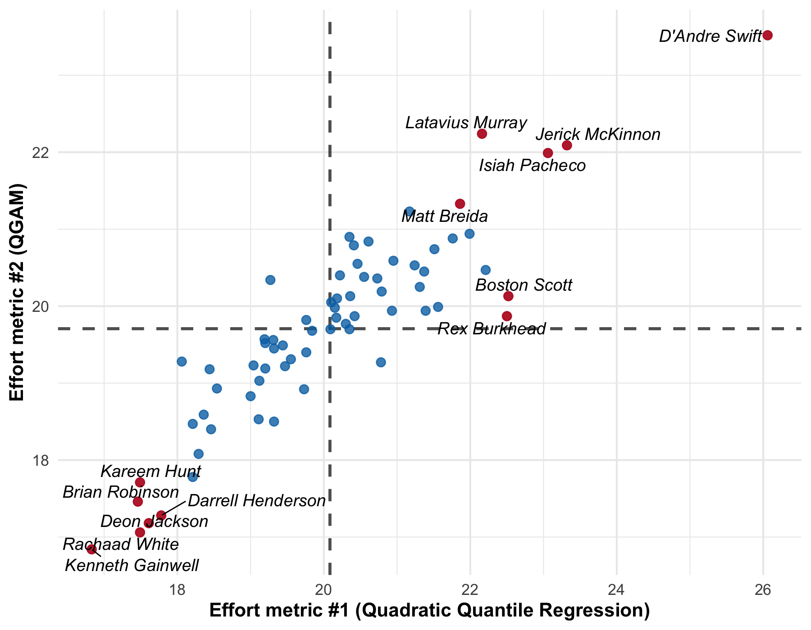

##

::: columns
::: column
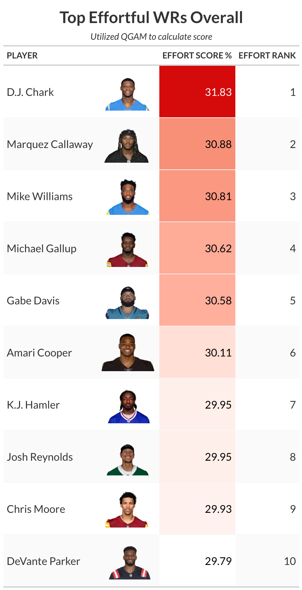
:::

::: column
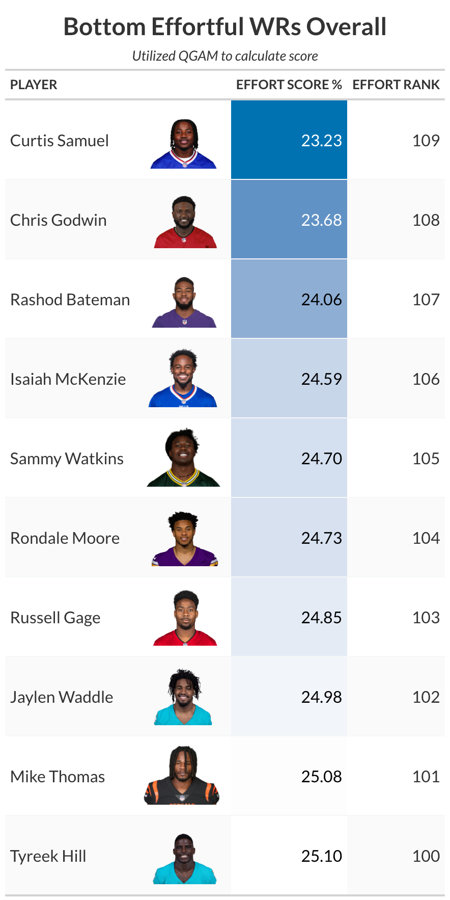
:::
:::

##

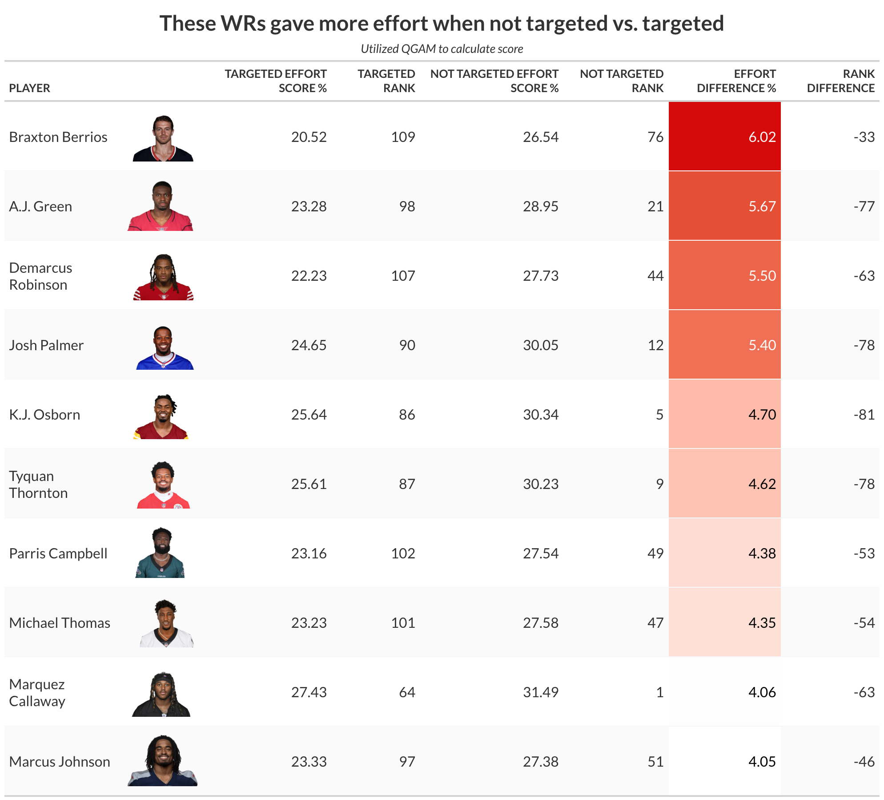

##

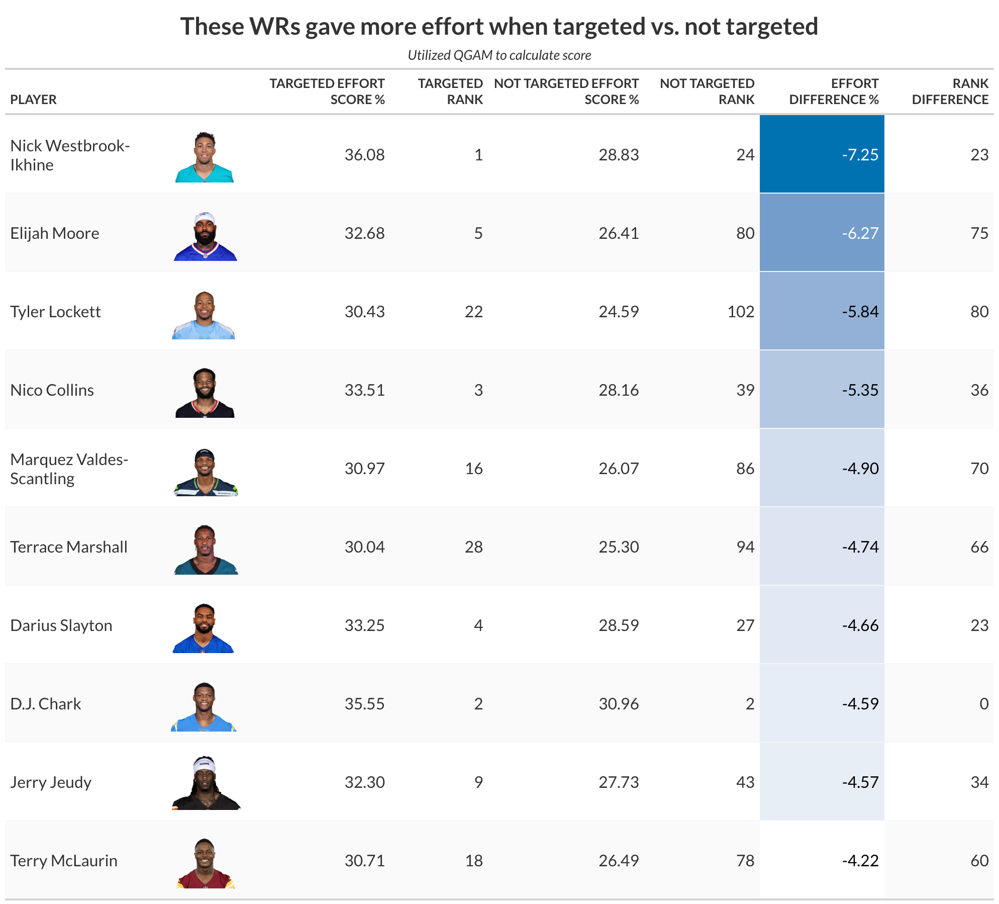

